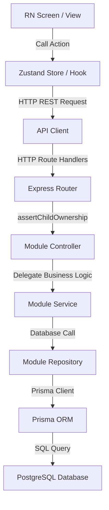

# PetalPath AI Bootloader Context

This file serves as a high-density "bootloader" configuration for AI coding assistants. Its purpose is to help future AIs immediately understand how the repository is structured, what principles govern the codebase, and where to locate deep-dive technical references, without preloading volatile implementation details.

---

## 1. Project Overview

PetalPath is a mobile, tablet, and web educational application designed for child learning, accompanied by parent dashboards and mentor guides. It utilizes a cross-platform React Native/Expo frontend and a modular Express/TypeScript backend to deliver adaptive curriculum progression, calculate mastery metrics, schedule reinforcement reviews, and generate parent insights.

---

## 2. Technology Stack

*   **Frontend**: React Native, Expo
*   **Backend**: Node.js, Express, TypeScript (ES Modules)
*   **Database**: PostgreSQL via Prisma ORM
*   **State Management**: Zustand (local UI state only; API/Server state cached directly)
*   **Authentication**: JWT, Google OAuth, Email/Password Local Auth
*   **Navigation**: React Navigation (Native Stack, Bottom Tabs)
*   **Styling**: React Native StyleSheet with centralized design tokens
*   **Deployment**: Docker Compose, Expo Application Services (EAS)

---

## 3. Architectural Principles

*   **Repository Isolation**: All database operations must be encapsulated within repository classes. Controllers and services must never import or invoke the Prisma client directly.
*   **Module Encapsulation**: Backend code is organized by distinct business modules. Each module owns its controllers, services, and repositories, exposing clean APIs.
*   **Responsive-First UI**: Layouts must be orientation-independent and responsive, utilizing dynamic viewport sizes rather than duplication.
*   **Configuration Centralization**: All subsystem scoring thresholds, review weights, and durations are loaded from a central engine configuration file.
*   **Backward Compatibility**: Public APIs, database schemas, and navigation parameters must remain compatible across feature iterations to prevent client crashes.

---

## 4. System Entry Points

Explore only these key entry points to understand the application skeleton:

*   **Database Schema**: `backend/prisma/schema.prisma` (SSOT for database tables and relations).
*   **Engine Config**: `backend/src/shared/config/engine.config.ts` (Consolidated learning parameters).
*   **Adaptive Orchestration**: `backend/src/modules/learner/learner-facade.service.ts` (Core entry point for learning APIs).
*   **Frontend Bootstrap**: `frontend/App.tsx` (Hydrates providers, caches, and global configurations).
*   **Navigation Hierarchy**: `frontend/src/navigation/RootNavigator.tsx` (Main screen routes and authorization stacks).
*   **Design Tokens**: `frontend/src/theme/colors.ts` and `frontend/src/theme/typography.ts` (Visual rules).
*   **Layout Selection**: `frontend/src/hooks/useDeviceType.ts` (Screen responsive breakpoint selector).

---

## 5. Major Subsystems

*   **Core Systems**: Manages parent users, children profiles, character mentors, and authentications. See code in `backend/src/modules/{users,children,mentors}/` and docs in `docs/backend/`.
*   **Curriculum Tree**: Establishes learning subjects, skills nodes, categories, and pre-requisite lock/unlock metrics. See code in `backend/src/modules/{categories,modules,lessons,activities,curriculum}/`.
*   **Adaptive Learning Engine**: The brain that handles mastery metrics, remediation scheduling, session block generation, and parent reporting profiles. See code in `backend/src/modules/{mastery,reinforcement,session,analytics,learner}/` and docs in `docs/adaptive-learning/`.

---

## 6. Communication Flow



---

## 7. Coding Patterns

*   **Layer Separation**: Endpoints route to Controllers (validate schemas and map envelopes), which call Services (evaluate business logic), which call Repositories (run queries).
*   **Zustand Store Boundary**: Zustand is strictly used for ephemeral local UI states (e.g. active tabs, audio playback controls, timers). API/Server payloads must be fetched and cached directly rather than mirrored into Zustand.
*   **Responsive Internals**: Screens must select layouts dynamically inside a single file using `useDeviceType()`. Do not duplicate files for mobile, tablet, and desktop views.
*   **Configuration Security**: Environment variables are validated centrally upon backend start (no raw `process.env` queries scattered in modules). Frontend config uses Expo public variables. Secrets must never be hardcoded.

---

## 8. Active Constraints

*   **Zero-Churn Policy**: Do not perform speculative refactoring, folder re-organizations, cleanups, or symbol renames in adjacent modules unless explicitly requested.
*   **Minimal Change**: Implement the smallest possible delta to solve the task. Avoid new abstractions, stores, or dependencies.
*   **Verification Gateways**: All parameter routes scoped to parent or child profiles must enforce authorization middleware checks.

---

## 9. Repository Health & Technical Debt

*   **Stable Modules**: Authentication, Child Profile CRUD, static curriculum category seeds, and the LearnerFacade read aggregates.
*   **Experimental / Planned Modules**: Spaced-repetition session planner constraints (`strictMode` generation), daily streak tracking registers, and database-driven rewards rules.
*   **Known Technical Debt**:
    *   Circular import dependencies in frontend Zustand stores during child context switches.
    *   Deprecated React Native `SafeAreaView` usages in legacy screens (must be migrated to `react-native-safe-area-context` when modifying them).

---

## 10. Common AI Mistakes to Avoid

*   **Bypassing the Repository**: Never write raw `prisma.model` queries in services or controllers; always route through repositories.
*   **Creating Duplicative Screens**: Do not compile separate viewport screens (e.g., `JourneyMobile.tsx` and `JourneyTablet.tsx`) for new features. Keep layouts unified.
*   **Hardcoding Colors and Layouts**: Avoid setting raw hex strings (`#8B78D8`) or pixels (`padding: 15`). Use centralized theme tokens.
*   **Omitting Ownership Middleware**: Never expose endpoints parameterized by IDs without registering ownership validation guards.

---

## 11. Recommended AI Workflow

```
   [Read AGENTS.md]
          │
          ▼
 [Read AI_CONTEXT.md]
          │
          ▼
 [Read Relevant Docs]
(Read specific files under
   /docs if needed)
          │
          ▼
   [Locate Files]
(Inspect only files relevant
to the current task)
          │
          ▼
    [Implement]
(Make minimal changes following
existing patterns)
          │
          ▼
    [Validate]
(Run validation & tests relevant
to the scope of edits)
```
