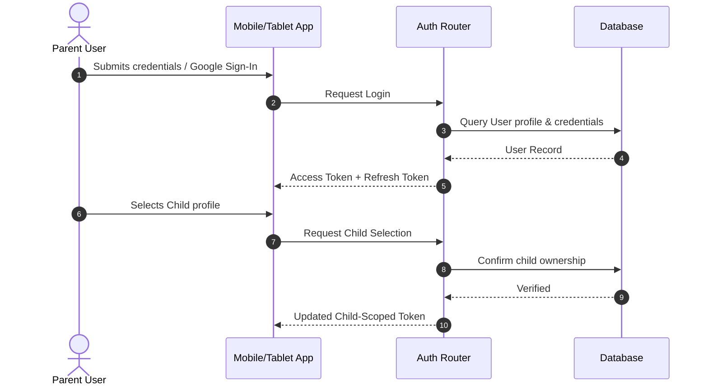
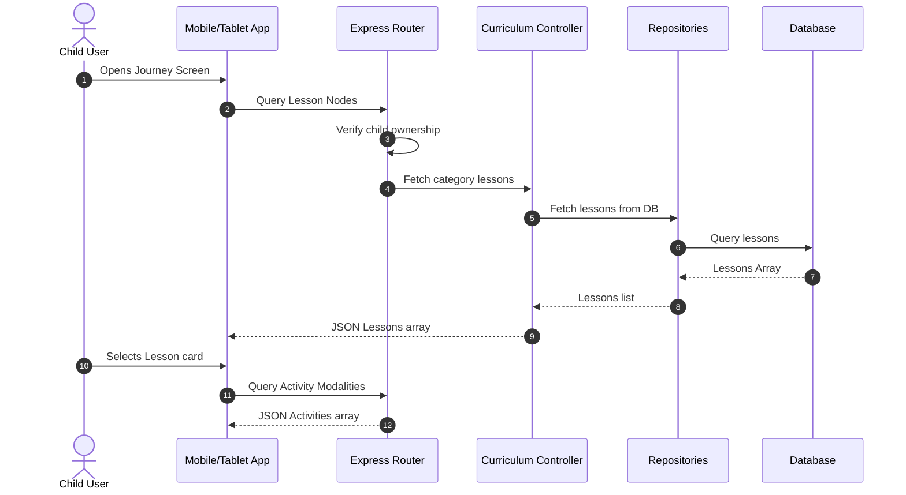
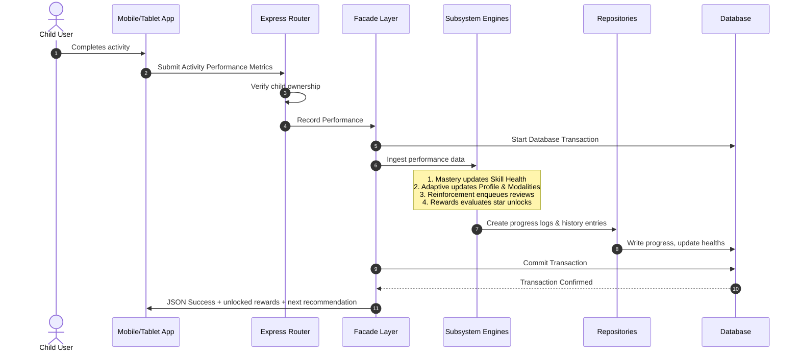
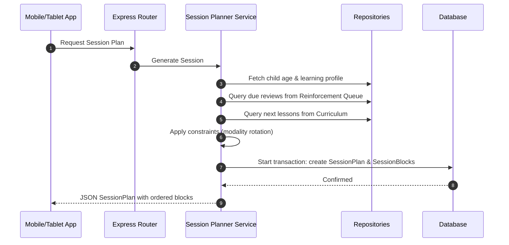
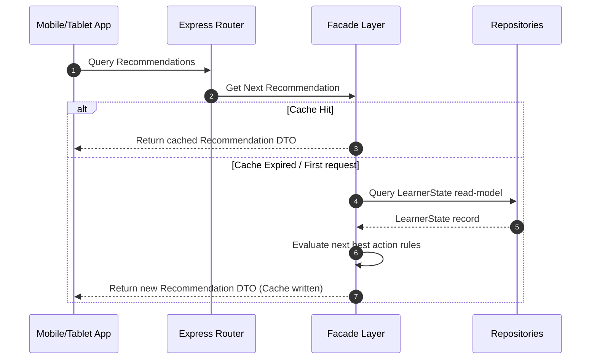
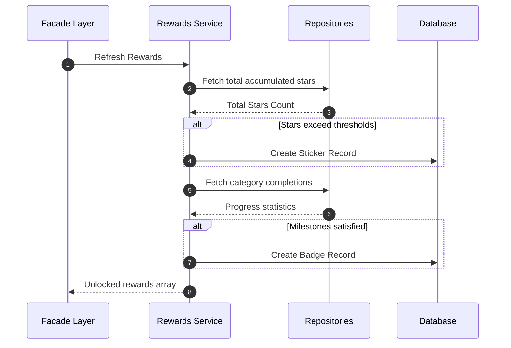

# System Communication Flows

This document details the dynamic communications, sequences, and transactional parameters that coordinate interactions between the PetalPath client application and the API server.

---

## 1. Authentication Flow

Authentication secures the parent user before scoping API queries to a specific child profile context.

---

## 2. Lesson & Activity Loading Flow

This sequence displays how curriculum nodes are requested and loaded for the active learning path screen.

---

## 3. Activity Completion & Progress Update

This is the transactional data write path. Multiple tables are updated within an atomic block to maintain database consistency.

---

## 4. Spaced Repetition Session Planner

When strict session planning is enabled, the planner generates personalized activity blocks.

---

## 5. Recommendation Generation

The facade caches recommendations to protect backend databases from request spam.

---

## 6. Rewards Evaluation Flow

Milestones calculations occur during activity completions.

