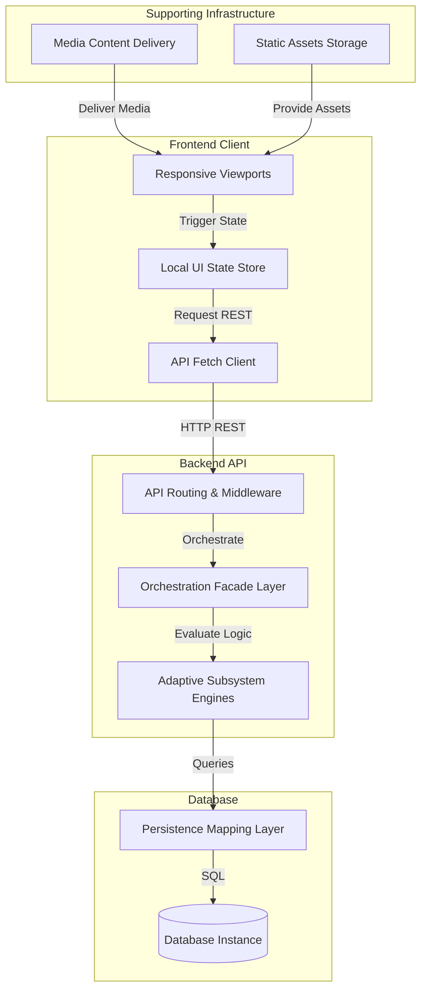

# High-Level Architecture Overview

This document provides a high-level overview of the architectural framework governing the PetalPath application. It outlines the system component topologies, structural layers, major subsystems, data paths, and core engineering principles that ensure the platform remains secure, responsive, and maintainable.

---

## 1. Purpose

The purpose of this document is to map out the high-level component dependencies and communication layers of PetalPath. It establishes a structural directory for developers to understand the boundaries between frontend presentation, backend business logic orchestration, database data access layers, and supporting adaptive engines.

---

## 2. System Overview

PetalPath operates as a client-server architecture consisting of a cross-platform presentation app, an authenticated modular backend API, a relational storage model, and isolated media assets.

---

## 3. Major Architectural Layers

*   **Presentation Layer**: Responsible for rendering child-friendly, responsive screens on phones, tablets, and web viewports. It handles animations, audio feedback execution, user interaction inputs, and client styling theme application.
*   **Application Layer**: Handles request routing, schema parsing, state coordination, and data transport formatting. It exists as client-side stores managing UI session variables and server-side routes, middlewares, controllers, and facade services mapping REST payloads.
*   **Domain Layer**: Houses the core business rules, pedagogical engines, and calculation rules. It includes mastery algorithms, spaced-repetition cadences, learning profile adaptations, and curriculum node unlocks.
*   **Data Layer**: Responsible for physical persistence and access control. It encapsulates data retrieval using repository abstractions, maps objects via the ORM client on the server, and persists local cached state on the client.
*   **Infrastructure Layer**: Comprises the environment config systems, logging frameworks, cross-origin rules, rate limiters, static file servers, and container runtime environments.

---

## 4. Major Subsystems

*   **Frontend**: A cross-platform mobile/tablet application that presents the child roadmap journey, manages profile switches, tracks active play timers, and processes audio playback. For details, see [Frontend Architecture](frontend.md).
*   **Backend**: An Express-based API server that parses routes, validates parent authorization, exposes modules endpoints, and structures JSON response envelopes. For details, see [Backend Architecture](backend.md).
*   **Adaptive Learning**: A collection of domain engines (curriculum, mastery, recommendation, and review scheduling) that evaluate child performances to output optimal lesson recommendations. For details, see the specs under `docs/adaptive-learning/`.
*   **Authentication**: A token validation system utilizing third-party OAuth sign-in and local email credential checks, issuing secure access and refresh tokens.
*   **Content**: Coordinates categories, modules, lessons, and activities (video guides, speaking, audio listening, writing paths) that populate the child curriculum tree.
*   **Analytics**: Accumulates child accuracy, confidence, and retention percentages into metric histories, generating daily time-bucketed trend logs and parent insights.
*   **Rewards**: Validates criteria (such as stars accumulated or lesson completions) to award stickers and unlock profile badges.
*   **Database**: A relational database that stores schema models, enums, indexes, and constraints, accessed exclusively through repositories.

---

## 5. High-Level Data Flow

1.  **Child Interaction**: The child selects an activity on the responsive UI roadmap and submits answers.
2.  **Frontend Dispatch**: The frontend client wraps the performance inputs (such as accuracy, attempts, and duration) and forwards them to the API client using an authorized token header.
3.  **API Gateway**: The backend routing layer interceptor checks credentials, enforces ownership middleware, parses input schema validation, and forwards the payload to the controller.
4.  **Business Logic Execution**: The controller passes the parsed parameters to the service layer. The service runs a transaction containing the mastery algorithm updates, enqueues necessary spaced reviews, and updates progression nodes.
5.  **Database Persistence**: The database repositories invoke persistence client commands to write logs, update metric snapshots, and save progress.
6.  **Adaptive Engine Aggregation**: The state builder compiles the database entries to update the denormalized read-model table, determines the next best action, and returns the response metadata back to the client.

For detailed sequences, see [Communication Flow](communication-flow.md).

---

## 6. Architectural Principles

PetalPath follows a set of strict guidelines to maintain codebase quality and separation of concerns. These include:
*   Repository Isolation
*   Module Encapsulation
*   Responsive-First Viewports
*   Centralized Configuration
*   Documentation-First Processes
*   Backward Compatibility
*   Minimal Change Principle

For details on these guidelines and boundaries, see [Architecture Principles](architecture-principles.md).

---

## 7. Cross References

To explore detailed specifications for individual layers, refer to:
*   [Architecture Principles](architecture-principles.md)
*   [Frontend Architecture Specs](frontend.md)
*   [Backend Architecture Specs](backend.md)
*   [Communication Flow Diagrams](communication-flow.md)
*   [Repository Structure Directory](repository-structure.md)
