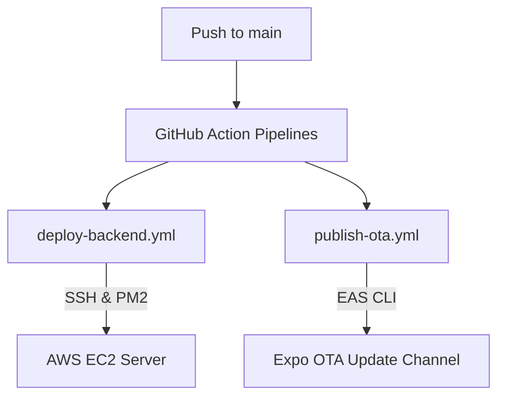

# Deployment & Operations Manual

This document details production deployment procedures, GitHub Actions CI/CD workflows, EAS OTA update pipelines, and emergency rollback procedures.

---

## 1. Production Deployment Architecture

The backend REST API server runs on an **AWS EC2 instance**, behind an **Nginx reverse proxy** mapping port `80` to the Express port `5000`.

* **Production API Base URL**: `https://api.petalpath.in` (currently maps to the temporary hosting IP `http://13.235.178.117`)
* **Static Assets Delivery**: Media files (audios, videos) are served from an **AWS S3 Bucket** and distributed globally via the **Amazon CloudFront CDN** at `https://dy3um9dzarz6y.cloudfront.net`.
* **Process Manager**: PM2 manages the Node runtime process in production, handling restarts and background persistence.

---

## 2. GitHub Actions Deployment Pipelines

Our monorepo features two independent deployment workflows triggered automatically on every push or merged pull request to the `main` branch.



### Workflow A: Backend Auto-Deployment (`deploy-backend.yml`)
* **Action**: Connects to the AWS EC2 server using GitHub secrets (`EC2_HOST`, `EC2_USERNAME`, `EC2_SSH_KEY`).
* **Execution steps on host**:
  1. Navigates to `~/PETALPATH_app_v2/backend`.
  2. Discards untracked local modifications: `git reset --hard origin/main`.
  3. Installs production dependencies and builds compiled TypeScript files in `dist/`.
  4. Applies database migrations: `npx prisma migrate deploy`.
  5. Refreshes the active PM2 process: `pm2 delete petalpath-api` and restarts `dist/server.js`.

### Workflow B: Frontend EAS OTA Publication (`publish-ota.yml`)
* **Action**: Sets up the Node.js runner and EAS CLI authenticated by `${{ secrets.EXPO_TOKEN }}`.
* **Execution steps**:
  1. Installs project dependencies inside `frontend/` using `npm ci`.
  2. Compiles the bundle and pushes an Over-The-Air (OTA) update to the `preview` branch:
     ```bash
     npx eas update --branch preview --message "${{ github.event.head_commit.message }}" --non-interactive
     ```
  3. Physical devices running the preview APK automatically fetch and load the update when restarted.

---

## 3. Operations & Recovery Guide

### Backend Troubleshooting & Rollback
If a backend deployment introduces bugs, execute one of the following:

#### Option 1: Git Revert (Recommended)
Roll back by pushing a revert commit to `main` (which automatically redeploys the last stable state):
```bash
git revert HEAD
git push origin main
```

#### Option 2: Host Reset (Fast Emergency Rollback)
SSH into the EC2 host and manually reset the server's working directory to the last known stable commit hash:
```bash
cd ~/PETALPATH_app_v2/backend
git reset --hard <STABLE_COMMIT_HASH>
npm install
npm run build
pm2 delete petalpath-api || true
pm2 start dist/server.js --name petalpath-api
pm2 save
```

---

### Frontend Update Rollbacks
If a buggy OTA update is pushed to the preview channel, you can roll back the release directly using the Expo CLI dashboard:

1. Look up your update history in the Expo dashboard:
   ```bash
   eas update:list --branch preview
   ```
2. Roll back the active branch state by repackaging and deploying a previous stable update hash:
   ```bash
   eas update:republish --group <STABLE_UPDATE_GROUP_ID>
   ```
   *This republishes the older stable build bundle under a new release version instantly, overriding the broken update.*
